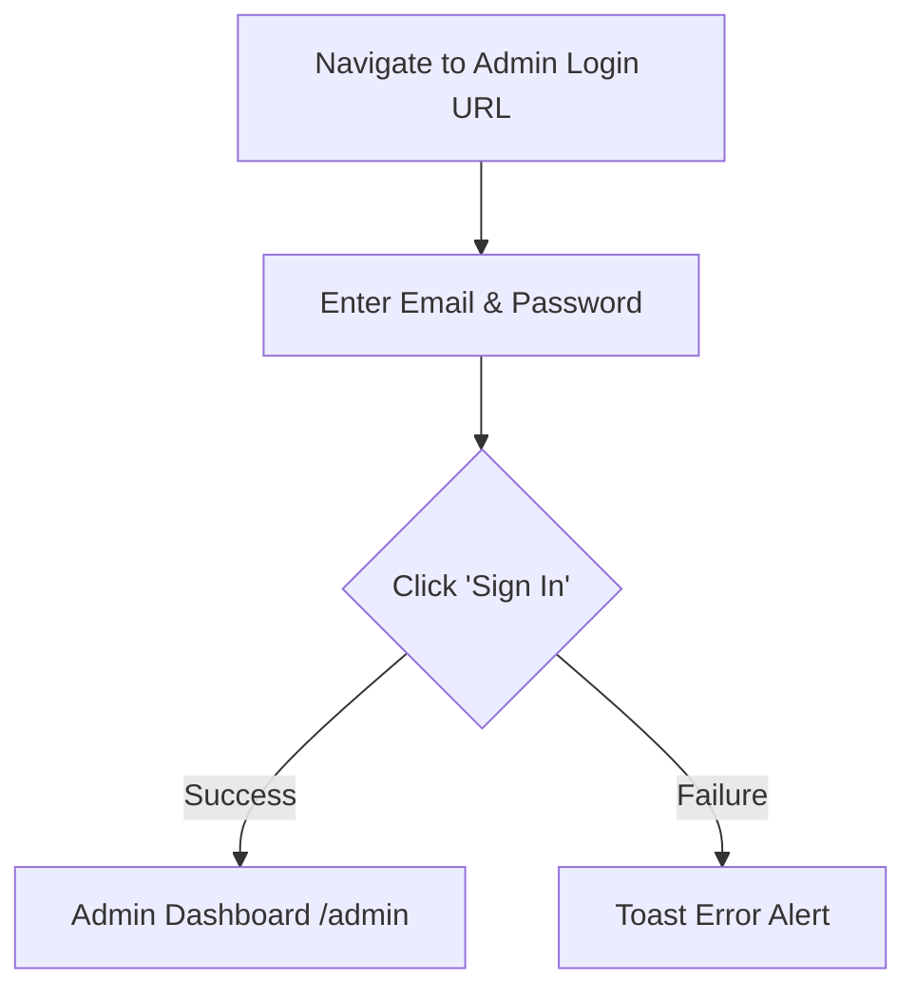

# Bold Realty Admin Portal: Property Management Guide

Welcome to the **Bold Realty Admin Portal**. This guide provides a detailed, step-by-step walk-through to help you successfully log in, navigate, and manage real estate listings on the platform.

---

## 📋 Table of Contents
1. [Prerequisites](#-1-prerequisites)
2. [Step-by-Step Guide](#-2-step-by-step-guide)
   - [Step 2.1: Accessing & Logging In](#step-21-accessing--logging-in)
   - [Step 2.2: Navigating to Properties](#step-22-navigating-to-properties)
   - [Step 2.3: Basic Information Fields](#step-23-basic-information-fields)
   - [Step 2.4: Media Upload & Watermarking](#step-24-media-upload--watermarking)
   - [Step 2.5: Details & Amenities](#step-25-details-&-amenities)
   - [Step 2.6: Available Layout Units](#step-26-available-layout-units)
   - [Step 2.7: Search Engine Optimization (SEO)](#step-27-search-engine-optimization-(seo))
   - [Step 2.8: Saving & Publishing](#step-28-saving-&-publishing)
3. [Managing Property Types & Categories](#-3-managing-property-types--categories)
4. [Best Practices & Troubleshooting](#-4-best-practices--troubleshooting)

---

## 🔒 1. Prerequisites

Before you begin, ensure you have:
1. **Admin Credentials:** A valid administrator email and password.
2. **Database Configured:** The Supabase database tables (`properties`, `property_categories`) and storage bucket (`images`) must be fully active. See [SUPABASE_SETUP.md](file:///Users/app/Documents/ndovubase%20projects/Bold%20Realty/real-estate-hub/SUPABASE_SETUP.md) for database instructions.
3. **Optimized Media:** High-resolution photographs of the property (supported formats: `.png`, `.jpg`, `.jpeg`, `.webp`).

---

## 🏗️ 2. Step-by-Step Guide

### Step 2.1: Accessing & Logging In
1. Open your web browser and navigate to the admin portal login address: 
   * **Development URL:** `http://localhost:5175/admin/login`
   * **Production URL:** The web address provided by your system administrator.
2. You will be greeted by the **Admin Login** screen.
3. Enter your registered email address (e.g., `admin@boldrealty.co.ke`).
4. Enter your secure password.
5. Click the **Sign In** button.
   * If login is successful, a confirmation toast notification will say **"Welcome back!"** and you will be redirected to the Admin Dashboard.

---

### Step 2.2: Navigating to Properties
Once authenticated inside the admin layout:
1. Locate the **Sidebar Menu** on the left side of the screen.
2. Click on the **Properties** navigation item (marked with a building icon 🏢). This displays a list of all currently listed properties.
3. At the top-right corner of the page, click the gold button labeled **Add Property** (with the `+` icon).
4. The screen will load the **Add New Property** form page.

---

### Step 2.3: Basic Information Fields
Fill in the essential parameters of the property inside the **Basic Information** panel:

| Field Name | Type | Requirement | Description / Example |
| :--- | :--- | :--- | :--- |
| **Title** | Text | **Required** | The public header of the listing. *E.g., "Luxury Villa in Karen" or "Clermont Residence"* |
| **Location** | Text | **Required** | The area/neighborhood. *E.g., "Kilimani, Nairobi" or "Westlands"* |
| **Starting Price (KES)**| Number | **Required** | The numerical base price without formatting. *E.g., enter `25000000` (renders as KSh 25,000,000)* |
| **Property Type** | Dropdown | **Required** | Class of property. E.g., `Apartment`, `Maisonette`, `Villa`, `Studio`, `Townhouse`. (Managed under Category Management) |
| **Listing Type** | Dropdown | **Required** | Options: `For Sale` or `For Rent`. |
| **Status** | Dropdown | **Required** | Options: `Ready`, `Off-Plan`, or `Sold`. |
| **Bedrooms** | Number | **Required** | Total count of bedrooms. |
| **Bathrooms** | Number | **Required** | Total count of bathrooms. |
| **Size (sqm)** | Number | Optional | Total area of the property in square meters. *E.g., `120`* |

> [!TIP]
> The system automatically populates the **Slug (URL)** in the SEO section as you type the title. If you change the title, the slug will update automatically unless you manually modify it.

---

### Step 2.4: Media Upload & Watermarking
The portal includes a automated image processing tool. 

1. Scroll down to the **Media** section of the form.
2. Drag and drop up to **10 images** into the dashed box, or click inside the box to browse files on your computer.
3. **Automatic Actions:**
   - **Watermarking:** The application applies the Bold Realty watermark onto your photographs.
   - **Compression & Formatting:** Photos are converted into optimized `.webp` formats and compressed to ensure fast page load speeds.
   - **Storage:** The files are uploaded directly to the Supabase `images` bucket storage.
4. Once uploaded, thumbnails will appear. You can remove any image by hovering over it and clicking the red **X** button.

> [!WARNING]
> Do not close the window while the progress bar shows **"Watermarking Images..."** or **"Compressing & Uploading..."**. Wait for the "Images uploaded successfully!" notification.

---

### Step 2.5: Details & Amenities
Input rich content to attract clients:

*   **Description (Required):** A detailed description of the property. Describe layout highlights, views, building features, payment terms, or security.
*   **Neighbourhood Description (Optional):** Details about the local environment (e.g., proximity to shopping malls, international schools, hospitals, security status, and road networks).
*   **Amenities (Optional):** A comma-separated list of highlights (e.g., `Swimming Pool, Gym, Backup Generator, Borehole, High-Speed Lifts`).
    > [!NOTE]
    > Separate amenities with a comma. The system automatically converts this string into search tags for the website filter.

---

### Step 2.6: Available Layout Units
For apartment blocks or housing estates with multiple layout options, you can list specific configurations:

1. Click **Add Unit Type**.
2. Enter the details for each configuration:
   - **Unit Type:** E.g., `3 Bedroom + DSQ` or `Studio Apartment`
   - **Size (sqm):** E.g., `150 sqm`
   - **Cash Price:** E.g., `KSh 14,500,000`
   - **Expected Rent:** E.g., `KSh 120,000/month`
3. Click the red trash icon next to a unit to delete it if added in error.

---

### Step 2.7: Search Engine Optimization (SEO)
To guarantee your listings rank well on search engines like Google, configure the SEO attributes:

*   **Meta Title:** A descriptive search engine title. (Recommended: **50–60 characters**).
    *   *Example: "Luxury Apartments for Sale in Westlands | Bold Realty"*
*   **Meta Description:** A short summary visible under the link in search results. (Recommended: **150–160 characters**).
    *   *Example: "Looking for premium luxury apartments in Westlands, Nairobi? Bold Realty offers state-of-the-art properties with high-speed lifts, gym, and borehole."*
*   **Slug (URL):** The permanent URL link.
    *   *Example: `luxury-apartments-for-sale-westlands`*
    *   *Rule: Only lowercase letters, numbers, and hyphens (no spaces or special characters).*
*   **Keywords:** Comma-separated search words.
    *   *Example: `Nairobi apartments, Westlands for sale, luxury homes`*

---

### Step 2.8: Saving & Publishing
1. **Featured Flag:** Check the **Mark as Featured Property** checkbox if you want this property displayed on the homepage slider/gallery.
2. **Review:** Quickly review all information to confirm accuracy.
3. **Save:** Click the gold **Save Property** button.
4. On success, you will receive a success alert and be redirected back to the Properties list.

---

## 🗂️ 3. Managing Property Types & Categories

If the property type you require (e.g., *Penthouse, Commercial Space, Warehouse*) is not available in the dropdown selector:

1. Navigate to the **Properties** list view (`/admin/properties`).
2. Click the **Manage Types** button next to "Add Property".
3. Under **Add New Category**:
   - Enter the name (e.g., `Penthouse`).
   - Choose the type: Select **Property Type** (for classifying structures) or **Listing Type** (for commercial structures/leases).
   - Click the gold **Add** button.
4. The category is instantly available in the property submission dropdown.

---

## 🛠️ 4. Best Practices & Troubleshooting

### 💡 Tips for High-Quality Listings
*   **Images:** Use landscape orientation (horizontal aspect ratio) for primary images. Avoid vertical phone photos if possible.
*   **Keywords:** Keep descriptions natural but sprinkle keywords (e.g., "ready apartments for sale in Kilimani", "luxury houses Karen") to rank on Google.
*   **Pricing:** If a property has a flexible price or relies on lease configurations, list the minimum starting price as the base price.

### ❓ Common Errors & Fixes
*   **Image Upload Fails:** 
    *   Check your internet connection.
    *   Verify the Supabase Storage Bucket policy permits authenticated users to write to `images` bucket. (See section 1 of [SUPABASE_SETUP.md](file:///Users/app/Documents/ndovubase%20projects/Bold%20Realty/real-estate-hub/SUPABASE_SETUP.md)).
*   **Save Button Loading Indefinitely:**
    *   Open your browser console (F12) to inspect the error log.
    *   Ensure all required fields (marked *Required* or with validation requirements) contain correct types. (e.g., numeric fields shouldn't contain letters).
*   **Slug Errors/Duplicates:**
    *   If you see "Error creating property", look out for slug collisions. Ensure that no other property already uses the exact same URL slug. Make the slug unique by appending the location or a year (e.g., `luxury-villa-karen-2026`).

---
*For support or technical assistance, contact the developer team or refer to the repository setup manual.*
